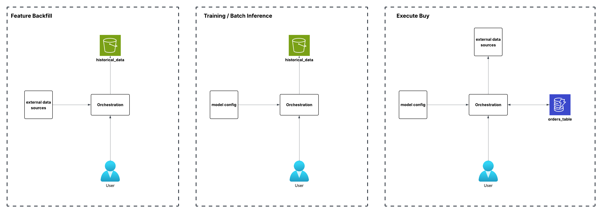

## Intro

This package orchestrates feature backfilling, training of TemporalFusionTransformer pytorch models, and executing trades based on forecasts generated by the model. The hld is as following:

  

## Key components

### Orchestration

The orchestration class divides all the main functionality into 4 distinct operations:

* Training
  * Training involves pulling model configuration details from configs.yaml and using those to construct our model and run training. Our config file includes details such as what features we want to run training on and also what we want to set hyperparameters to for the model. We also need data so we pull our datasets from the TrainingDataModule as well. Then we run training. After training is complete the model artifact is uploaded to s3 (if run locally) for re-use.
* Batch Inference
  * Batch Inference involves pulling our model artifact from s3 and running predictions on a large dataset. This means generating predictions for multiple symbols over multiple days. For example right now I'm using 500 stocks and running batch inference over the course of one year (2025). We then upload the predictions to s3.
* Evaluation
  * After batch inference was complete now we can actually simulate a trading strategy based on those predictions. For example our trading strategy could be buy and sell the top 10 stocks with the highest forecasted change in price over the entire period. We would then simulate that strategy over say 1 year and then calculate the return from that strategy and the sharpe ratio / sharpe p value's.
* Executing Trading
  * Finally after we've decided on a model and trading strategy we then can actually run our strategy daily. This function will pull your model artifact, pull necessary data to run inference for one day, run inference, then finally decide what stocks to buy based on the results. Then it will actually execute the buy order and also sell out any existing stocks owned. Finally it will record all the executions its done in dynamoDB

