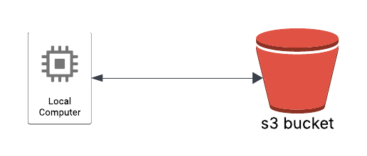
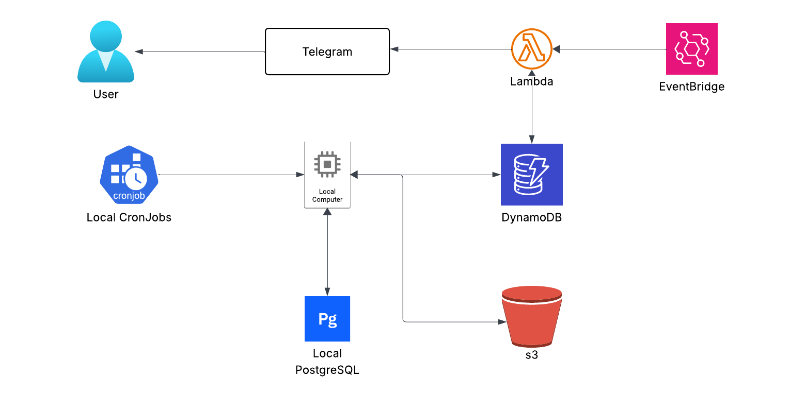

## HLD

### Dictionary

- Training: Fitting a model on historical features over a configured train/validation window (`train_start` → `train_end` → `val_end`). Produces a checkpoint for the given `model_id` which is saved locally and uploaded to S3 so it can be reused by batch inference, evaluation, and live trading.
- Batch Inference: Generating predictions in bulk for many historical timesteps at once, rather than a single forward-looking forecast. For each trading day in the test window, the model produces its full prediction horizon (e.g. the next 14 days). The saved predictions are the input to Evaluation — batch inference itself doesn't score accuracy.
- Evaluation: Consumes the predictions saved by batch inference and runs a trading-algorithm simulation against them (e.g. picking N stocks per week by predicted return and volatility) to estimate how the strategy would have performed historically. This is where profitability is actually scored — batch inference only produces the raw predictions.
- Feature Backfill: Pulls raw historical stock bars from the data provider for a given list of symbols and date range, derives the configured feature set, and uploads the result to S3 so training and inference can read features without re-hitting the upstream API.
- Execute Buy: execute buy is the main live trading simulation setup, this is used to simulate a model trading. For example you could be running a trading strategy that involves buying some set of stocks every wednesday. For that example you would run execute buy every wednesday, and that particular models trade decisions would get logged in transactions psql table and dynamodb.

### Training / Batch Inference / Evaluation / Feature Backfill

  

### FAQ

1. Why use S3 for storing features data and model checkpoints instead of local store?

The primary reason for this is that the amount of storage this data takes is quite high. Right now my local rig consists of a single 500GB SSD. So I would very quickly run out of storage if I stored this data locally. S3 Blob store is quite cheap also so its not much of an issue. In the future I'll probably make some updates to my rig and I can start storing things locally. But for now the cost so far is basically zero still, so I'll probably wait for cost to become an issue.

2. Why use local compute for training / batch inference / evaluation?

On the other hand training via sage maker is very expensive, I actually initially started this project using sagemaker but the cost was just way to high and I already had a 3070 ti and 4070 ti so I decided to use that instead. That being said, AWS definitely isn't the most cost efficient solution and I could probably find a much cheaper solution but I think I prefer to just run training locally, and long term things like price changes from these cloud providers isn't something I need to worry about.

### execute buy workflow

  

### FAQ

1. What is Event Bridge, Lambda, and DynamoDB and Telegram used for?

@src/ai_stock_forecasts/lambda/check_if_execute_buy_ran.py is what we are running in the lambda. The purpose of this whole setup is just to validate that my model ran for a given day on my local computer, everything locally is automated via cron jobs, so I like having this additional set of remote validations to make sure my models run when I expect them to run. For example if I have a cron job scheduled to run execute buy at 5pm on wednesdays, I then have another event bridge scheduled for 10pm to validate that the local run was successful run, if it did not run successfully then I get a telegram message telling me I need to check and see what went wrong locally.

2. Why are we storing essentially same data in transactions psql table and dynamodb?

For analytics I run full scans over the table. This can start becoming quite expensive and slow over time as the number of models I run simultaneously grows over time. So the ideas is we use transactions table for analytics, and dynamodb is something we just keep around to run that remote validation that the runs you expect to happen, happen.

3. What is s3 for?

We store our model checkpoints in s3.

4. What cron jobs are you running?

- anacron jobs are used to schedule and run execute_buy.
- cron jobs are used to run @src/ai_stock_forecasts/cron/populate_historical_features_daily_grain_psql_table.py

5. What is populate_historical_features_daily_grain_psql_table.py cron job for?

The purpose of this script is to pre-pull all the necessary raw data from our external APIs that we use for features data such as yFinance. The reason we seperate the data pull from execute_buy is that we want to run execute_buy many times, but we only want to pull the necessary data once. Originally I had it set up to pull external data within the execute_buy directly but because of rate limits, execute_buy was taking 20+ minutes to run, because I was pulling a lot of data. This way execute_buy is taking less than a minute now to pull the data from the historical_features psql table locally instead.

### Key Files

1. 'Orchestration' is the entry point for training, batch inference, evaluation, and execute_buy
2. 'BackfillFeaturesUtil' is the main util used for backfilling features data to s3 for training.
3. 'ModelPerformanceVisualizer' is what we use to compare different models performance3. 'ModelPerformanceVisualizer' is what we use to compare different models performance3. 'ModelPerformanceVisualizer' is what we use to compare different models performance
